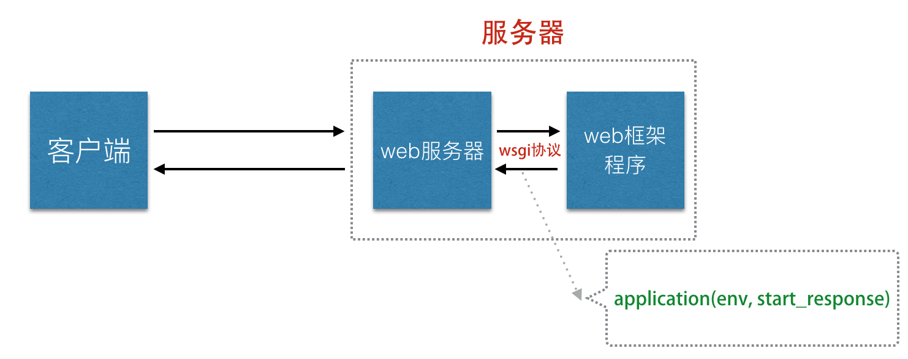

# Flask框架第一天
## web程序运行的基本流程
### 口述
## flask框架的特点和核心
### 简洁、轻量、扩展性强
### werkzeug和Jinja2
## 环境的配置和安装
### 虚拟环境
* mkvirtualenv 虚拟环境名称 创建python2的环境
* mkvirtualenv -p python3 虚拟环境名称 创建python3 的虚拟环境
* workon进入
* deactivate 退出
* rmvirtualenv 移除虚拟环境
### 依赖文件
* pip freeze > requirements.txt生成依赖文件
* pip install -r requirements.txt安装依赖文件
## 基本程序的实现
### 实现helloworld
### 1、__name__参数的作用，确认程序所在的位置，默认创建静态路由，方便静态文件的访问。
### 2、route函数第一个参数表示url路径，必须以斜线开始，后面可以指定请求方法
### 3、可以不使用装饰器实现路由映射，add_url_rule()第一个表示url路径、第二个表示端点(视图函数名的字符串)、第三个参数表示视图函数名
### 4、视图函数不可以重名，请求的url路径可以重复。
### 5、run方法可以传入host、port、debug
### 6、debug表示调试模式，只有在开发模式开启，生产模式下一定不能开启。
## 扩展阅读：百度上搜索：浏览器大战。

    1. 描述web服务器和web框架的作用及其关系。
    • 答：
    • web服务器作用：
    •  1）解析请求报文,调用框架程序处理请求。 
    •  2）组织响应报文,返回内容给客户端。 
    • web框架程序的作用：
    •  1）路由分发(根据url找到对应的处理函数) 。
    •  2）在处理函数中进行业务的处理。 
  

# web server 

## the basic flow of web program operation

## MVT
mysql_tab  def  html

view 业务处理
template 渲染
model   存储

蓝图  class

## web运行流程
client send request
server return response

app是应用程序

client: browser, 应用程序app, code(spider), 测试工具（模拟浏览器）

web程序运行的基本流程：
http://www.baidu.com ->
1. 访问dns域名解析服务器，获取百度ip地址
 DNS:域名解析服务器{域名: ip and port}
世界上有 13台 ipv4根域名服务器，ipv4的域名解析服务器,china didn't
2. 向百度服务器发送请求（请求报文）
Request Headers: requset_addr
                request_method: get/post/put/delete
3. 返回相应报文，如果请求的静态资源（html/css/js/image), 
&nbsp;&emsp;&emsp;&emsp;&emsp;&emsp;&emsp;&emsp;&emsp;&emsp;&emsp;&emsp;
                          动态资源  根据请求的资源返回不同数据

服务器: 1u  2u  3u  normal志强系列cpu  
监听端口／接受请求／返回相应 
写接口（视图函数，视图类，请求处理类）／调接口（调用别人的接口) 
增删改查  －(查询，返回)＞  数据库

## a simple Flask
1. from flask import Flask
2. create Flask application instance
3. define view function and binding url
4. run server 

in development normal use thinkpad ,Mac 32G 4T  50000￥

## about state code
302 重定向
304 缓存

4**   请求方错误 (html js)
400 bad requery
403 forbidden
404 have't source 
405 request_method not allow

5** server error

## about time
格林威治时间＋　７GWT
6:30 AM
Tuesday, 16 October 2018(GWT+1)
Time in Greenwich, London, UK

date
2018年 10月　16日 星期二　13:34:58  CST

## about flask
3个月 flask
使用框架开发web好处:
  使用框架
  降低开发难度，提高开发效率
  避免重复造轮子

flask (烧瓶)
  轻巧
  简介
  扩展性强
  核心: werkzeug and jinja2
      werkzeug: python module
      jinja2: template 引擎 

1990 browser 用来交流文档 Berners-lee

  2010start 4.1 flask   werkzeug的基础上  url -> view function
  2006 django
  1989  python

flask 原生不支持数据库

tornado 高效的web框架   C10k 一秒一万以上的并发
几百上千flask  
the top of taobao -> 1s/ 20000 

并发量多少？  
如何实现更高的并发？  

## about virtual environment
learn flask==0.10

2020year python2 will not update

1. create virtual environment 
mkvirtualenv temp_py2 
mkvirtualenv -p python3 temp_py3

2. see 
workon temp_python

3. exit 
deactivate

4. delete 
rmvirtualenv temp_py2

## config environment 
pip list 当前环境依赖包

cd project1

1. 指定版本     
pip install flask==0.10.1

2. 生成依赖文件, 冻结 -> 依赖包       
pip freeze > requirements.txt

3. 安装依赖文件      
pip install -r requirements.txt

4. see modules      
help('modules')

## 常用Flask扩展包
Flask-sQLAlchemy: 操作数据库
Flask-WTF: web form
Flask-script: support command line options
Flask-Migrate: transfer (create database table) 
Flask-Mail: email
Flask-Login: Authenticated user state
Flask-RESTful: develop tool of REST API
Flask-Session: session information storage

