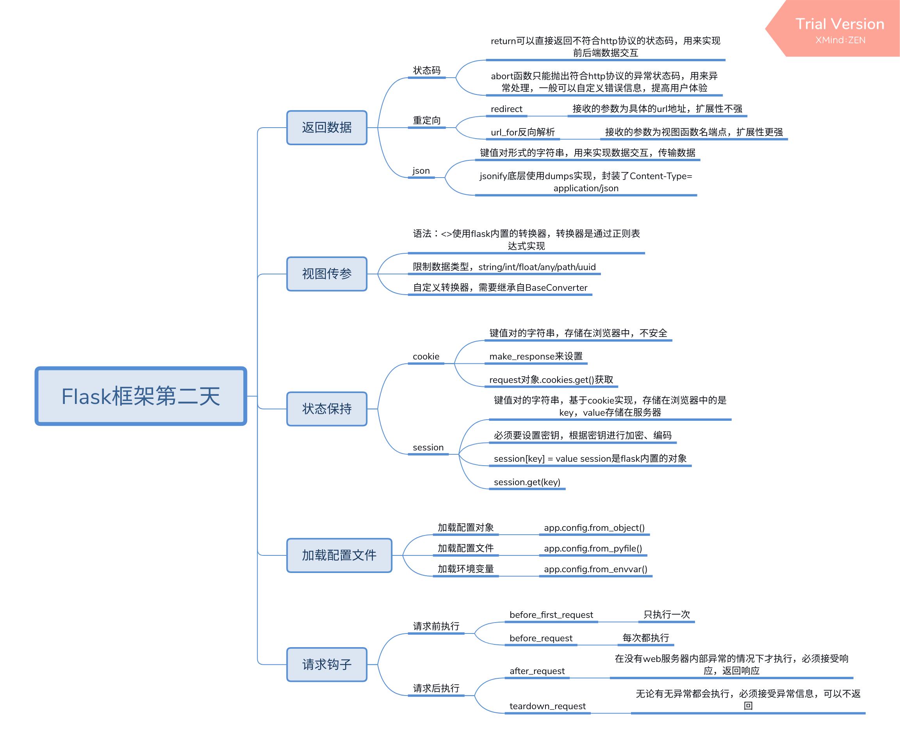

# base
## 返回数据
### 状态码
* return 可以直接返回不符合http协议的状态码，用来实现前后端数据交互
* abort函数只能跑出符合http协议的异常状态码，用来异常处理，一般可以自定义错误信息，提高用户体验
### 重定向
* redirect  接受的参数为具体的url地址，扩展性增强
* url_for反向解析   接收的参数为视图函数名端点，扩展性强
### json
* 键值对形式的字符串，用来实现数据交互，传输数据
* jsonify底层使用dumps实现，封装了Content-Type=application/json
## 视图传参
### 语法：<>使用flask内置的转换器，转换器是通过正则表达式实现
### 限制数据类型，string/int/float/any/path/uuid
### 自定义转换器，需要继承自BaseConverter
## 状态保持
### cookie
* 键值对的字符串，存储在浏览器中，不安全
* make_response来设置
* request对象.cookies.get()获取
### session
* 键值对的字符串，基于cookie实现，存储在浏览器中的是key，value存储在服务器
* 必须要设置密钥，根据密钥进行加密、编码
* session[key] = value session是flask内置的对象
* session.get(key)
## 加载配置文件
### 加载配置对象
* app.config.from_object()
### 加载配置文件
* app.config.from_pyfile()
### 加载环境变量
* app.config.from_envvar()
## 请求钩子
### 请求前执行
* before_first_request
    * 只执行一次
* before_request
    * 每次都执行
### 请求后执行
* after_request
    * 在没有web服务器内部异常的情况下才执行，必须接受响应，返回响应
* teardown_request
    * 无论有无异常都会执行，必须接受异常信息，可以不返回

# 基本程序的扩展
1. 返回状态码和abort函数

2. 重定向

3. JSON

4. 给URL传递参数<>

5. 正则URL

6. 状态保持

    因为 http 是一种无状态协议，浏览器请求服务器是无状态的。
    
    无状态：指一次用户请求时，浏览器、服务器无法知道之前这个用户做过什么，每次请求都是一次新的请求。
    
    无状态原因：浏览器与服务器是使用 socket 套接字进行通信的，服务器将请求结果返回给浏览器之后，会关闭当前的 socket 连接，而且服务器也会在处理页面完毕之后销毁页面对象。
    有时需要保持下来用户浏览的状态，比如用户是否登录过，浏览过哪些商品等
    
    实现状态保持主要有两种方式：
    在客户端存储信息使用Cookie
    在服务器端存储信息使用Session 
    
    无状态协议: 
    协议对于事务处理没有记忆能力 
    对同一个 url 请求没有上下文关系 
    每次的请求都是独立的，它的执行情况和结果与前面的请求和之后的请求是无直接关系的，它不会受前面的请求应答情况直接影响，也不会直接影响后面的请求应答情况 
    服务器中没有保存客户端的状态，客户端必须每次带上自己的状态去请求服务器 
    人生若只如初见

7. 请求勾子

    为了让每个视图函数避免编写重复功能的代码，Flask提供了通用设施的功能，即请求钩子。
    
    在客户端和服务器交互的过程中，有些准备工作或扫尾工作需要处理，比如：
    
    在请求开始时，建立数据库连接； 
    在请求开始时，根据需求进行权限校验； 
    在请求结束时，指定数据的交互格式；

8. 程序加载配置

    在 Flask 程序运行的时候，可以给 Flask 设置相关配置，比如：配置 Debug 模式，配置数据库连接地址等等，设置 Flask 配置有以下三种方式：
    从配置对象中加载(常用)
    
    app.config.from_object()
    
    从配置文件中加载
    
    app.config.from_pyfile()
    
    从环境变量中加载(了解)
    
    app.config.from_envvar()
    
# 上下文
客户端发送请求，服务器回复响应。

上下文（RequestContext）：

1、request封装了HTTP请求作为对象。

2、session封装了用户信息作为对象

# request
request 就是flask中代表当前请求的 request 对象，其中一个请求上下文变量(理解成全局变量，在视图函数中直接使用可以取到当前本次请求)

常用的属性如下：

|属性|	说明	|类型| 
|---|---|----|---|
data	|记录请求的数据，并转换为字符串|	* 
form	|记录请求中的表单数据	|MultiDict 
args	|记录请求中的查询参数	|MultiDict 
cookies	|记录请求中的cookie信息|	Dict 
headers	|记录请求中的报文头	|EnvironHeaders 
method|	记录请求使用的HTTP方法	|GET/POST 
url|	记录请求的URL地址	|string 
files|	记录请求上传的文件	|* 

# Decorator Route

Flask有两大核心：Werkzeug和Jinja2

- Werkzeug实现路由、调试和Web服务器网关接口
- Jinja2实现了模板。

Werkzeug是一个遵循WSGI协议的python函数库

- 其内部实现了很多Web框架底层的东西，比如request和response对象；
- 与WSGI规范的兼容；支持Unicode；
- 支持基本的会话管理和签名Cookie；
- 集成URL请求路由等。

Werkzeug库的 routing 模块负责实现 URL 解析。不同的 URL 对应不同的视图函数，routing模块会对请求信息的URL进行解析，匹配到URL对应的视图函数，执行该函数以此生成一个响应信息。

routing模块内部有：

Rule类
 用来构造不同的URL模式的对象，路由URL规则

Map类 
存储所有的URL规则和一些配置参数

BaseConverter的子类
 负责定义匹配规则

MapAdapter类 
负责协调Rule做具体的匹配的工作

# 杂记
类名() # 会执行类

# 请说明钩子函数的作用及其调用顺序。
    •  在web服务器调用框架程序处理每个请求的过程中，框架的处理有一定的顺序，在某个处理的节点上，允许我们根据实际的需要添加相应的函数，这些函数叫做钩子函数。
    •  有了钩子函数，我们可以根据自己的需要在请求前后添加函数进行一些处理。
        • 钩子函数

    • 说明
    • beforefirstrequest
    • 在服务器启动之后，接收第一个请求时调用
    • before_request
    • 处理每个请求时，在视图函数调用之前调用
    • after_reuqest
    • 处理每个请求时，在视图函数调用之后并且视图未抛出异常时调用
    • teardown_request
    • 处理每个请求时，在视图函数调用之后调用，如果视图抛出异常，此函数的参数就是抛出的异常对象

# 请说明为什么需要进行状态保持及状态保持的方案和特点。
    •  http协议是一个无状态协议，即同一个用户进行操作时，服务器在处理某个请求时并不知道上一次请求的操作，但在开发过程中，实际需要去保存一些操作的信息以备之后进行使用，所以需要进行状态保持。
    • 状态保持的方案:
    •  1）cookie
    •  2）session
    • cookie特点：
    •  1）由服务器生成，交给浏览器进行保存的一小段文本信息。
    •  2）cookie以键和值的形式进行存储。
    •  3）浏览器在访问服务器时，会自动将和被访问服务器相关的所有cookie信息发送给对应的服务器。
    •  4）cookie存在过期时间，默认关闭浏览器过期。
    • session特点：
    •  1）session保存在服务器端。
    •  2）session以键和值的形式进行存储。
    •  3）session依赖于cookie，每个客户端对应的session信息的标识保存在cookie中。
    •  4）session也是由过期时间的，Flask框架中session默认关闭浏览器过期。
 
     3. 使用Flask实现cookie和session的设置及获取。
    • 涉及知识点：
    • 1）cookie的设置和获取
	    设置cookie: 
		通过make_response创建响应对象，调用响应对象的set_cookie方法设置cookie信息
		获取cookie:
		通过request对象的cookies属性获取客户端发送的cookie数据
    • 2）session的设置和获取
        设置session:
            session['键'] = '值'
        获取session:
            session.get('键')