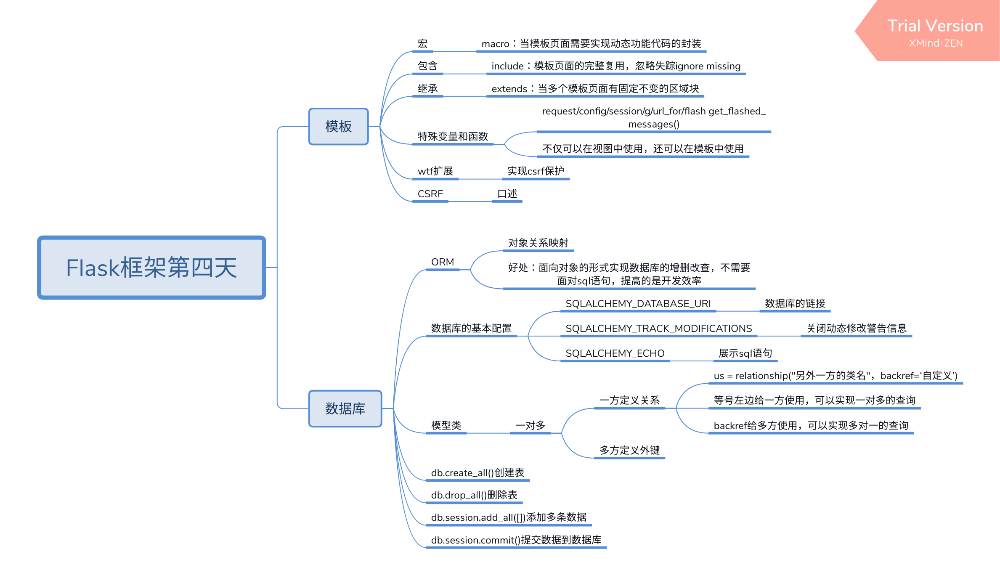

## 继承block(very important)
顶部底部中间部分内容相同使用继承
模板不支持多重继承
endblock(结束标签可以起名字,标识和他匹配的block),没有的话，结束离它最近的

## 宏Macro(相当于function)　only use in template
作用: 模板复用
根据参数不同封装动态代码块

### difference
继承: 固定一样的<br>
宏: 可调用, 可传参, 可封装，(as起别名: 防止调用重名)

## 包含include
copy完全复制
ignore missing: 如果源文件失效不报错

# 特有变量/函数（特殊: 既可以在视图，也可以在模板中用)
config

request
{{request.url}}

session

g (临时存储数据)

url_for()

get_flashed_messages()(消息闪现)
提示用户信息(有可能会报错,不建议使用, ascii错误, 浏览器重启能解决)
u''也不能解决(中文编码)
flash('') # 列表容器


# web表单(flask-wtf)
表单: 刷新页面会自动提交数据,应该阻止

模板加载不需要使用action,默认找render_template它的

前端 && 后端校验

postman,
spider,
程序,
都可以伪造表单数据

cookies同源策略

把正常网站有安全漏洞url放入到自己的网站中，对外隐藏参数
```html
使用<a>隐藏
```
钓鱼网站

环境变量

# 数据库例子

一对多
多对多

自关联一对多
省   市　  区
朋友圈     你也用我也用

自关联多对多
微博      粉　   被粉

## 三范式
列　原子性   不可分割
表当中必须要有主键依赖
非主属性之间不存在依赖关系...   

## sql
oracle 一年大概 几百万

one day probable write 100 200 row code

大的项目大概有50张表

1-多 使用　backref
多多 使用  primary_join 


# Flask框架第四天
## 模板
### 宏
* macro：当模板页面需要实现动态功能代码的封装
### 包含
* include：模板页面的完整复用，忽略失踪ignore missing
### 继承
* extends：当多个模板页面有固定不变的区域块
### 特殊变量和函数
* request/config/session/g/url_for/flash get_flashed_messages()
* 不仅可以在视图中使用，还可以在模板中使用
### wtf扩展
* 实现csrf保护
### CSRF
* 口述
## 数据库
### ORM
* 对象关系映射
* 好处：面向对象的形式实现数据库的增删改查，不需要面对sql语句，提高的是开发效率
### 数据库的基本配置
* SQLALCHEMY_DATABASE_URI
    * 数据库的链接
* SQLALCHEMY_TRACK_MODIFICATIONS
    * 关闭动态修改警告信息
* SQLALCHEMY_ECHO
    * 展示sql语句
### 模型类
* 一对多
    * 一方定义关系
        * us = relationship("另外一方的类名"，backref=‘自定义’)
        * 等号左边给一方使用，可以实现一对多的查询
        * backref给多方使用，可以实现多对一的查询
    * 多方定义外键
### db.create_all()创建表
### db.drop_all()删除表
### db.session.add_all([])添加多条数据
### db.session.commit()提交数据到数据库

