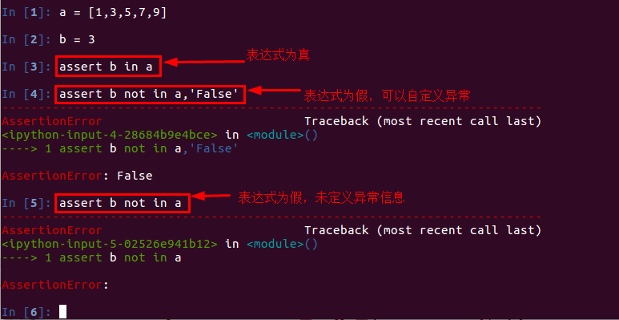

# 单元测试
Web程序开发过程一般包括以下几个阶段：[需求分析，设计阶段，实现阶段，测试阶段]
其中测试阶段通过人工或自动来运行测试某个系统的功能。
目的是检验其是否满足需求，并得出特定的结果，以达到弄清楚预期结果和实际结果之间的差别的最终目的。

## 测试的分类：
测试从软件开发过程可以分为：

    单元测试
    对单独的代码块(例如函数)分别进行测试,以保证它们的正确性
    
    集成测试
    对大量的程序单元的协同工作情况做测试
    
    系统测试
    同时对整个系统的正确性进行检查,而不是针对独立的片段
## assert
断言就是判断一个函数或对象的一个方法所产生的结果是否符合你期望的那个结果。
python中assert断言是声明布尔值为真的判定，
如果表达式为假会发生异常。单元测试中，一般使用assert来断言结果。
## use

## 断言语句类似于：

    if not expression:    
        raise AssertionError
     AssertionError
## 常用的断言方法：

    assertEqual     如果两个值相等，则pass
    assertNotEqual  如果两个值不相等，则pass
    assertTrue      判断bool值为True，则pass
    assertFalse     判断bool值为False，则pass
    assertIsNone    不存在，则pass
    assertIsNotNone 存在，则pass

<>表示对象，有属性和方法

url_prefix='api'    # 给url添加前缀

一个模块使用一个路由映射,方便管理

## 一个产品的形成
需求，设计   # 招标    产品运行图   平面效果图
 实现20%time     #设计静态页面         写接口(测接口postman)     实现交互   
测试阶段(单元测试:   有可能写)     #项目测试      比较实际结果和预期结果

前后端越来越没有明确的界线     node.js 出现了

tearDown测试数据库必须要用，移除数据库会话对象

测试数据库时,如果会话对象不移除会一直卡在那里，（数据库一定要移除测试会话）

mongodb:  存储 文档形式

## mysql两种引擎区别(事物)
MyISAM是MySQL的默认数据库引擎（5.5版之前），由早期的ISAM（Indexed Sequential Access Method：有索引的顺序访问方法）所改良。虽然性能极佳，但却有一个缺点：不支持事务处理（transaction）。不过，在这几年的发展下，MySQL也导入了InnoDB（另一种数据库引擎），以强化参考完整性与并发违规处理机制，后来就逐渐取代MyISAM。

InnoDB，是MySQL的数据库引擎之一，为MySQL AB发布binary的标准之一。InnoDB由Innobase Oy公司所开发，2006年五月时由甲骨文公司并购。与传统的ISAM与MyISAM相比，InnoDB的最大特色就是支持了ACID兼容的事务（Transaction）功能，类似于PostgreSQL。目前InnoDB采用双轨制授权，一是GPL授权，另一是专有软件授权。

1、 存储空间
MyISAM：可被压缩，存储空间较小。支持三种不同的存储格式：静态表(默认，但是注意数据末尾不能有空格，会被去掉)、动态表、压缩表。
 InnoDB：需要更多的内存和存储，它会在主内存中建立其专用的缓冲池用于高速缓冲数据和索引。

2、 事务支持
MyISAM：强调的是性能，每次查询具有原子性,其执行数度比InnoDB类型更快，但是不提供事务支持。 
InnoDB：提供事务支持事务，外部键等高级数据库功能。 具有事务(commit)、回滚(rollback)和崩溃修复能力(crash recovery capabilities)的事务安全(transaction-safe (ACID compliant))型表。

## 杂记
hash 就是一个hash对象（一个key对应多个key value)

mysql(读写跟硬盘中，跟redis差10倍以上)   read:    write

服务器一般没有固态硬盘

mysql表之间的结构复杂，redis不可以替代

新浪微博  use redis集群

redis   守护进程(后台进程)

window　不支持守护进程

terminal    运行python hello.py 阻塞进程

一台电脑可以跑多个redis, 不同port

思路最重要

json和redis  无缝对接(使用")

UTF-8：一个汉字 = 3个字节，英文是一个字节
GBK： 一个汉字 = 2个字节，英文是一个字节
100M 500多万汉字

有专门的图片数据库
视频存路径

zset 编号（权重）不是真正的有序

StrictRedis兼容当前版本
Redis   兼容老版本

redis集群
    读10     写1
    
    就近访问    
    
    dba 运维人员    架设主从服务器/集群
    
    15000毫秒
    
    依赖ruby    
    
    -c　表示集群
    
    开启16384个    slots   槽
    
    ip自动跳转
    
    投票机制: 一个master 挂了，会把一个从当主
    
    memcached 不支持持久化，淘汰

蓝图  :   延迟创建路由映射
    无法独立运行
    当register 时添加

# Flask_day06
## 蓝图
### 创建蓝图对象
### 使用蓝图对象
### 注册蓝图对象给程序实例app
### 再次拆分的文件，导入到创建蓝图对象的下面，避免循环导入
## 单元测试
### 概念：检查实际结果与预期结果之间的差距
### 本质是断言assert
### 自定义测试类，导入unittest
### 需要继承自unittest.TestCase
### setUp方法名固定，一般用来初始化操作
### tearDown方法名固定，一般用来扫尾工作
### 测试方法，方法名必须以test开头

