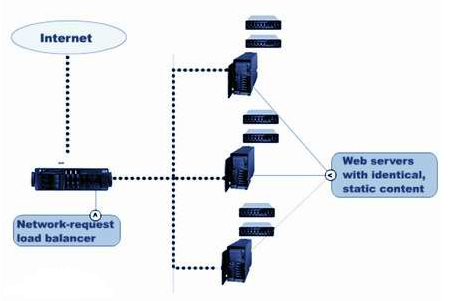
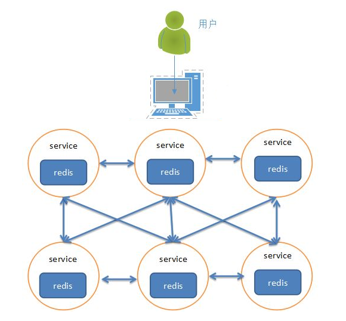
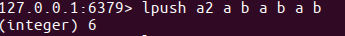
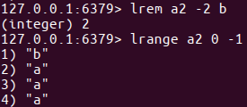

# REDIS
## 主从
### 主从概念
* ⼀个master可以拥有多个slave，⼀个slave⼜可以拥有多个slave，如此下去，形成了强⼤的多级服务器集群架构
* master用来写数据，slave用来读数据，经统计：网站的读写比率是10:1
* 通过主从配置可以实现读写分离 

* master和slave都是一个redis实例(redis服务)
### 主从配置
### 配置主
1. ifconfig
2. sudo vi redis.conf   #修改 /usr/local/etc/redis.conf  or /etc/redis/redis.conf
bind ip
3. restart
sudo service redis stop
redis-server redis.conf

### 配置从
1. cope /etc/redis/redis.conf
sudo cp redis.conf ./slave.conf
2. 修改redis/slave.conf
bind ip
slaveof ip:6379
port 6378
3. redis server
sudo redis-server slave.conf
4. see master and slave relative
redis-cli -h ip info Replication

### 数据操作
- 在master和slave分别执⾏info命令，查看输出信息 进入主客户端

redis-cli -h 192.168.26.128 -p 6379

- 进入从的客户端

redis-cli -h 192.168.26.128 -p 6378

- 在master上写数据

set aa aa

- 在slave上读数据

get aa

## 集群
之前我们已经讲了主从的概念，一主可以多从，如果同时的访问量过大(1000w),主服务肯定就会挂掉，数据服务就挂掉了或者发生自然灾难

大公司都会有很多的服务器(华东地区、华南地区、华中地区、华北地区、西北地区、西南地区、东北地区、台港澳地区机房)

### 集群的概念
- 集群是一组相互独立的、通过高速网络互联的计算机，它们构成了一个组，并以单一系统的模式加以管理。一个客户与集群相互作用时，集群像是一个独立的服务器。集群配置是用于提高可用性和可缩放性。当请求到来首先由负载均衡服务器处理，把请求转发到另外的一台服务器上。 

### redis集群
- 分类
  - 软件层面
  - 硬件层面
  - 软件层面：只有一台电脑，在这一台电脑上启动了多个redis服务。

    

  - 硬件层面：存在多台实体的电脑，每台电脑上都启动了一个redis或者多个redis服务。
  
    
    
  参考: redis集群搭建 http://www.cnblogs.com/wuxl360/p/5920330.html
          [Python]搭建redis集群 http://blog.5ibc.net/p/51020.html
    (file:///home/name/Documents/courseware/RedisNode/redis/da-jian-ji-qun/chuang-jian-ji-qun.html)

### python交互
pip install redis-py-cluster

redis-py-cluster源码地址https://github.com/Grokzen/redis-py-cluster
  
## redis数据库
### 基于内存存储key、value形式的NoSQL数据库
### 启动server(指定加载配置文件): redis-server /usr/local/etc/redis.conf 
### start client: redis-cli;test: ping
### string
* set/mset/get/mget/setex/expire/exists/ttl/keys/select/append
### hash
* hset/hmset/hget/hmget/hkeys/hvals
### list
* lpush/rpush/lrange/linsert/lset
### set
* sadd/smembers
### zset
* zadd/zrange/zrangbyscrore/zscore
### python交互
* 响应的类型是bytes类型，必须要使用decode_response，让响应为str
### 主从和集群
## flask_session
### 指定状态保持session信息存储的位置，配置签名、sessionkey，
### 有效期使用flask自带的配置，因为扩展包指定session永远不过期

## 数据结构
    redis是key-value的数据结构，每条数据都是⼀个键值对
    键的类型是字符串
    注意：键不能重复
    

## string类型
 字符串类型是 Redis 中最为基础的数据存储类型，它在 Redis 中是二进制安全的，这便意味着该类型可以接受任何格式的数据，如JPEG图像数据或Json对象描述信息等。在Redis中字符串类型的Value最多可以容纳的数据长度是512M。
 
 
 
 
 
 
 
 
 
 
## hash
 
hash⽤于存储对象，对象的结构为属性、值
 
值的类型为string

 
 
 
 
 
 
 
 
 
 

## list类型
列表的元素类型为string
按照插⼊顺序排序

### 增加
在左侧插⼊数据

lpush key value1 value2 ...

例1：从键为'a1'的列表左侧加⼊数据a 、 b 、c

lpush a1 a b c

在右侧插⼊数据

rpush key value1 value2 ...

例2：从键为'a1'的列表右侧加⼊数据0 1

rpush a1 0 1

在指定元素的前或后插⼊新元素

linsert key before或after 现有元素 新元素

例3：在键为'a1'的列表中元素'b'前加⼊'3'

linsert a1 before b 3

### 获取
返回列表⾥指定范围内的元素

start、stop为元素的下标索引
索引从左侧开始，第⼀个元素为0
索引可以是负数，表示从尾部开始计数，如-1表示最后⼀个元素
lrange key start stop

例4：获取键为'a1'的列表所有元素

lrange a1 0 -1

设置指定索引位置的元素值
索引从左侧开始，第⼀个元素为0
索引可以是负数，表示尾部开始计数，如-1表示最后⼀个元素

lset key index value

例5：修改键为'a1'的列表中下标为1的元素值为'z'

lset a 1 z

### 删除
删除指定元素

将列表中前count次出现的值为value的元素移除
count > 0: 从头往尾移除
count < 0: 从尾往头移除
count = 0: 移除所有
lrem key count value

例6.1：向列表'a2'中加⼊元素'a'、'b'、'a'、'b'、'a'、'b'

lpush a2 a b a b a b

例6.2：从'a2'列表右侧开始删除2个'b'

lrem a2 -2 b

例6.3：查看列表'py12'的所有元素

lrange a2 0 -1

## set类型
⽆序集合
 元素为string类型
 元素具有唯⼀性，不重复
 说明：对于集合没有修改操作

## 增加
添加元素

sadd key member1 member2 ...

例1：向键'a3'的集合中添加元素'zhangsan'、'lisi'、'wangwu'

sadd a3 zhangsan sili wangwu

## 获取
返回所有的元素

smembers key

例2：获取键'a3'的集合中所有元素

smembers a3

## 删除
删除指定元素

srem key

例3：删除键'a3'的集合中元素'wangwu'

srem a3 wangwu

## zset类型(并不是真正的有序)
sorted set，有序集合
 元素为string类型
 元素具有唯⼀性，不重复
 每个元素都会关联⼀个double类型的score，表示权重，通过权重将元素从⼩到⼤排序
 说明：没有修改操作

## 增加
添加

zadd key score1 member1 score2 member2 ...

例1：向键'a4'的集合中添加元素'lisi'、'wangwu'、'zhaoliu'、'zhangsan'，权重分别为4、5、6、3

zadd a4 4 lisi 5 wangwu 6 zhaoliu 3 zhangsan

## 获取
返回指定范围内的元素
start、stop为元素的下标索引
索引从左侧开始，第⼀个元素为0
索引可以是负数，表示从尾部开始计数，如-1表示最后⼀个元素

zrange key start stop

例2：获取键'a4'的集合中所有元素

zrange a4 0 -1

返回score值在min和max之间的成员

zrangebyscore key min max

例3：获取键'a4'的集合中权限值在5和6之间的成员

zrangebyscore a4 5 6

返回成员member的score值

zscore key member

例4：获取键'a4'的集合中元素'zhangsan'的权重

zscore a4 zhangsan

## 删除
删除指定元素

zrem key member1 member2 ...

例5：删除集合'a4'中元素'zhangsan'

zrem a4 zhangsan

删除权重在指定范围的元素

zremrangebyscore key min max

例6：删除集合'a4'中权限在5、6之间的元素

zremrangebyscore a4 5 6

