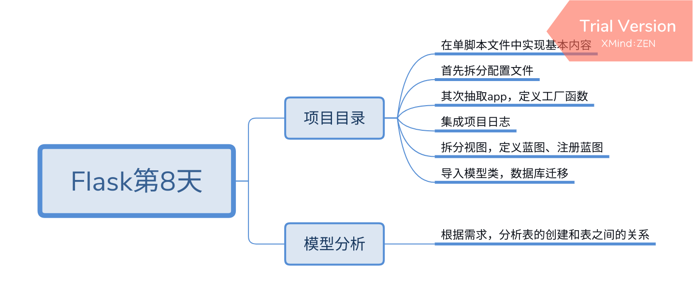
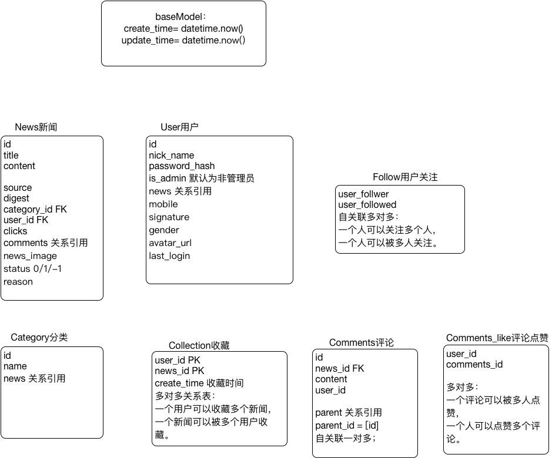

1. pycharm -> setting -> version control -> 可以添加git

2. 写接口过程:
    获取参数
    检查参数
    业务处理
    返回接口

3. 前后端不分离:
    后端使用了模板
    (数据给模板
    渲染
    给浏览器)
    
4. 前后端分离  
    数据交互形式: ajax    数据直接给浏览器　后档处理业务逻辑   数据展示
    
    有 redirect    url_for 不是前后端分离
    
    优点: 模块解耦    提高开发效率
     
5. web网站: 图片的存储(%30-%70)占比例较重, 字符串站的少

6. 服务器选择
werkzeug python自带服务器
Gunicorn    服务器     

7. 配置  初始化
init　（首先找的就是init.py)导包方便，初始化操作，
蓝图, 实例创建放在init中

8. 蓝图怎么知道他自己被拆分使用了
: 把抽取出去的视图导入到注册蓝图底下

9. log等级:
    FATAL/CRITICAL = 重大的，危险的
    ERROR = 错误
    WARNING = 警告
    INFO = 信息
    DEBUG = 调试
    NOTSET = 没有设置

10 .1024*1024   1M

11. 需求分析

    需求文档
    
    关键词提取
    
    如果是个字段  放在那个表里，　如果是个表　怎么设计   

12 加密

    密码加密之后不能还原  sha256
    
    王小云(反向破解)
    
    hash冲撞(key相同)

# Flask第8天
## 项目目录
### 在单脚本文件中实现基本内容
### 首先拆分配置文件
### 其次抽取app，定义工厂函数
### 集成项目日志
### 拆分视图，定义蓝图、注册蓝图
### 导入模型类，数据库迁移
## 模型分析
### 根据需求，分析表的创建和表之间的关系

