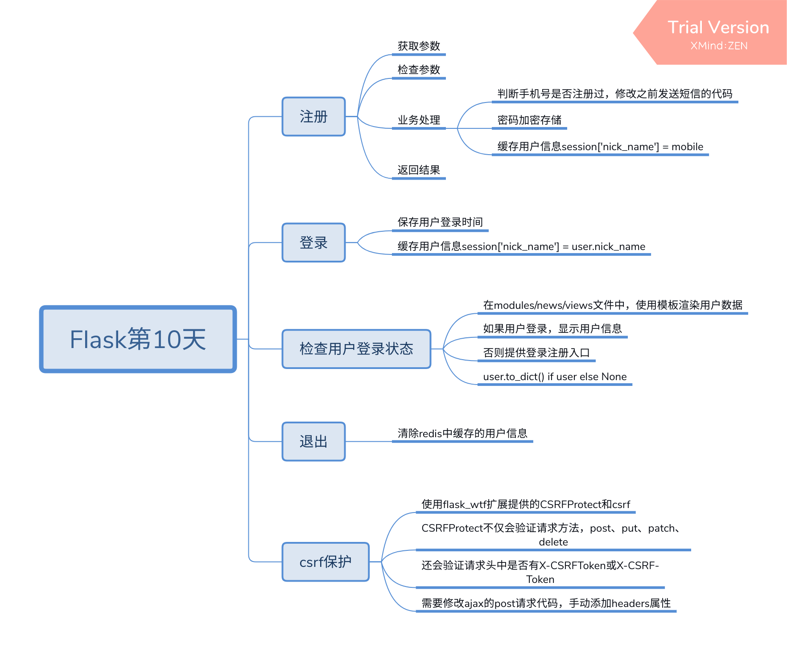

libs    官网sdk

如果接口文档错了，先修改接口文档，(白纸黑字)

方向推断那些手机号注册过    钱和安全权衡

TODO

xmlhttprequest异步网络请求
xml     数据交互    可扩展标签语言，都是闭合标签

 

$.get
$.post
$.ajax  异步网络请求      ajax能够实现更精确的属性的控制   headers
ajax不会阻塞网络请求

review:
ajax优缺点

中间服务器

client  server

models 中datetime.now没有()

注释，不建议改代码

改是情分，不该是本分

js/css改都要clear cache

当天不让登陆
验证
修改

request context object : derefent session object
登录有问题
nickname　some problem

多个用户多个线程，进化
吞吐量

execute a code reprent javascript

makeresponse    route

服务器内部异常     请求钩子

注册完之后跳转

# Flask第10天
## 注册
### 获取参数
### 检查参数
### 业务处理
* 判断手机号是否注册过，修改之前发送短信的代码
* 密码加密存储
* 缓存用户信息session['nick_name'] = mobile
### 返回结果
## 登录
### 保存用户登录时间
### 缓存用户信息session['nick_name'] = user.nick_name
## 检查用户登录状态
### 在modules/news/views文件中，使用模板渲染用户数据
### 如果用户登录，显示用户信息
### 否则提供登录注册入口
### user.to_dict() if user else None
## 退出
### 清除redis中缓存的用户信息
## csrf保护
### 使用flask_wtf扩展提供的CSRFProtect和csrf
### CSRFProtect不仅会验证请求方法，post、put、patch、delete
### 还会验证请求头中是否有X-CSRFToken或X-CSRF-Token
### 需要修改ajax的post请求代码，手动添加headers属性

user.password   有问题入库不了
注册之后数据库中找不到
session是存在一个数据库里面吗
那么多人注册都存在一个数据库里面
一个新的会话对象

render_template寻找路径
寻找当前路径同级的template
到底在哪里执行
os.path

先建立数据库

多线程

repr    to_dict 

服务器重启登录状态会消失吗
断点要了干啥

